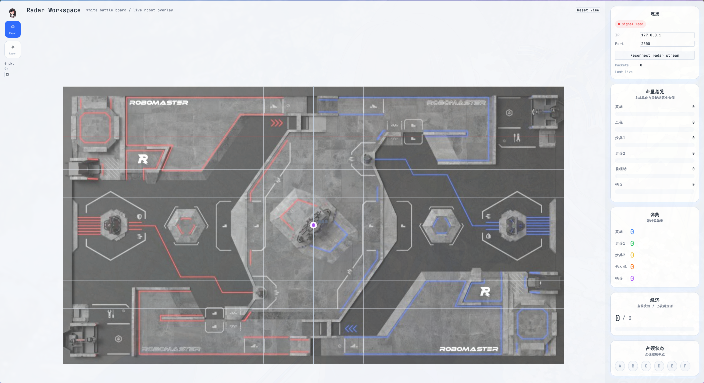
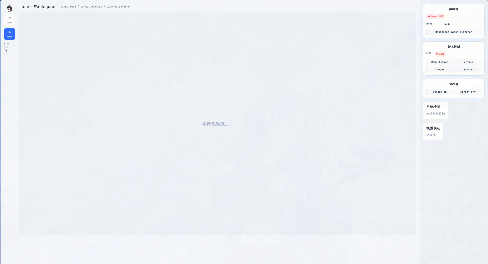

# radar-egui

基于 Rust + egui 的 RoboMaster 比赛实时雷达 HUD。

## 简介

radar-egui 通过 TCP 连接 SDR 数据流，解析 RoboMaster 比赛状态数据包，实时显示战场信息，包括机器人位置、血量、弹药、经济和增益状态。

## 环境要求

- Rust 工具链 (1.75+)
- Linux (X11 或 Wayland)
- SDR 数据源运行在 `127.0.0.1:2000`

## 构建与运行

```bash
# 构建
cargo build --release

# 运行
cargo run --release

# 带日志运行
RUST_LOG=info cargo run --release
```

## 截图

### Radar HUD



### Laser HUD



## UI 布局

- 左侧紧凑模式栏：切换 `Radar / Laser` 和深浅色主题
- 中央主舞台：`Radar` 显示可拖拽/缩放的小地图，`Laser` 显示 16:9 视频主画面
- 右侧信息栏：连接、控制、血量、弹药、经济、增益，以及 `Laser` 的目标检测/模型候选

### 当前 UI 特性

- 小地图支持拖拽、滚轮缩放和 `Reset View`
- 默认使用 `assets/minimap_bg.png` 作为小地图背景资源
- 左上角圆形头像使用 `assets/logo.png`
- 深色模式基于 Catppuccin 风格调色

## 数据源

radar-egui 从 `alliance_radar_sdr` 通过 TCP 接收数据：

| 端口 | 方向 | 数据 |
|------|------|------|
| `127.0.0.1:2000` | 接收 | RoboMaster_Signal_Info (102 字节) |

### 数据包结构

| cmd_id | 名称 | 字段 | 字节数 |
|--------|------|------|--------|
| 0x0A01 | 位置 | 6 机器人 × [i16, i16] | 26 |
| 0x0A02 | 血量 | 6 机器人 × u16 | 14 |
| 0x0A03 | 弹药 | 5 机器人 × u16 | 12 |
| 0x0A04 | 经济 | 剩余(u16) + 总计(u16) + 状态(6B) | 12 |
| 0x0A05 | 增益 | 5 机器人 × [1+2+1+1+2] + 姿态(1) | 38 |

字节序：大部分字段大端序，增益子字段中 2 字节部分为小端序。

## 可用接口

| 端口 | 方向 | 数据 | 状态 |
|------|------|------|------|
| `127.0.0.1:2000` | 接收 | 信号流 (102 bytes) | ✅ 已对接 |
| `127.0.0.1:3000` | 接收 | 噪声流 (7 bytes) | ❌ 未对接 |
| `192.168.1.10:2000` | 接收 | 数据中心标记 (12 bytes) | ❌ 未对接 |
| `192.168.1.10:3000` | 发送 | 位置+噪声数据 | ❌ 未对接 |

## 模块结构

```
src/
├── main.rs           # 入口，egui 窗口初始化
├── protocol.rs       # RoboMasterSignalInfo 结构体 + 二进制解析器
├── tcp_client.rs     # 异步 TCP 客户端，自动重连
├── rerun_viz.rs      # Rerun 3D 可视化集成
├── app.rs            # egui 应用，布局和交互
├── theme.rs          # Catppuccin Mocha 配色
└── widgets/
    ├── mod.rs        # 重导出
    ├── minimap.rs    # 2D 战场小地图 (Painter)
    └── panels.rs     # 血量/弹药/经济/增益面板
```

## 依赖

- `eframe` / `egui` — 即时模式 GUI
- `tokio` — 异步 TCP 客户端
- `log` / `env_logger` — 日志
- `rerun` — 3D 可视化（可选）

## 构建与运行

```bash
# 基础版本
cargo build --release
cargo run --release

# 带 Rerun 3D 可视化
cargo run --features rerun

# 带日志
RUST_LOG=info cargo run --release
```

## 许可证

MIT
