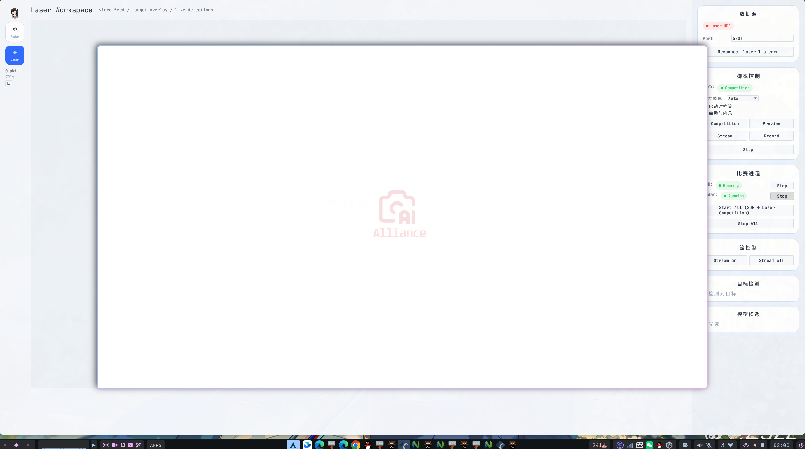

# radar-egui

基于 Rust + egui 的 RoboMaster 比赛实时雷达 HUD，承担**比赛顶层进程控制**。

## 简介

radar-egui 是比赛系统的统一操作面板：

- **Radar 标签**：TCP 接入 SDR 信号流，实时显示 RobotMaster 战场状态
- **Laser 标签**：UDP 接收激光引导观测数据，共享内存渲染视频画面
- **进程控制**：一键启动 SDR 桥接、laser_guidance 守护进程、Unity RADAR
- **开局配置**：敌方颜色选择、推流/内录开关，启动时自动同步到 daemon

## 环境要求

- Rust 工具链 (1.75+)
- Linux (X11 或 Wayland)
- 中文字体：LXGW WenKai Mono GB Screen、JetBrainsMono Nerd Font、Maple Mono
- SDR 数据源运行在 `127.0.0.1:2000`
- laser_guidance 已构建（UDP :5001 + 共享内存 `/laser_frame`）

## 一键部署

通过雷达系统顶层 `deploy.sh`：

```bash
cd ~/radar
./deploy.sh              # 拉取 + 构建全部
./deploy.sh egui         # 仅构建 radar-egui
./deploy.sh theme        # 安装字体 + zsh 主题
./deploy.sh autostart    # 配置开机自启动
```

## 截图

### Radar HUD


### Laser HUD


### 集成概览



## UI 布局

- **左侧模式栏**：Radar / Laser 切换、深浅色主题、数据统计
- **中央主舞台**：Radar 小地图（拖拽/缩放），Laser 视频画面（16:9）
- **Laser 右侧面板**：
  - 数据源 — UDP 连接状态与重连
  - 脚本控制 — 敌方颜色下拉、推流/内录复选框、laser_guidance 启动按钮
  - 比赛进程 — SDR/Unity 独立启停、Start All / Stop All
  - 流控制 — 运行时 Stream on/off 开关
  - 分析面板 — 目标检测/模型候选

### 当前 UI 特性

- 小地图支持拖拽、滚轮缩放和 `Reset View`
- 开局预设：敌方颜色（Red/Blue/Auto）、推流、内录，daemon 启动后通过 FIFO 自动同步
- 深色模式基于 Catppuccin 风格调色

## 数据源

radar-egui 从 `alliance_radar_sdr` 通过 TCP 接收数据：

| 端口 | 方向 | 数据 |
|------|------|------|
| `127.0.0.1:2000` | 接收 | RoboMaster_Signal_Info (102 字节) |

### 数据包结构

| cmd_id | 名称 | 字段 | 字节数 |
|--------|------|------|--------|
| 0x0A01 | 位置 | 6 机器人 × [i16, i16] | 26 |
| 0x0A02 | 血量 | 6 机器人 × u16 | 14 |
| 0x0A03 | 弹药 | 5 机器人 × u16 | 12 |
| 0x0A04 | 经济 | 剩余(u16) + 总计(u16) + 状态(6B) | 12 |
| 0x0A05 | 增益 | 5 机器人 × [1+2+1+1+2] + 姿态(1) | 38 |

字节序：大部分字段大端序，增益子字段中 2 字节部分为小端序。

### 激光数据

| 端口 | 方向 | 数据 |
|------|------|------|
| UDP `0.0.0.0:5001` | 接收 | LaserObservation 协议包 |
| SHM `/laser_frame` | 读取 | RGB 视频帧（双缓冲） |

## 许可证

MIT

## 模块结构

```
src/
├── main.rs           # 入口，egui 窗口初始化
├── app.rs            # egui 应用，布局、交互、进程控制
├── protocol.rs       # RoboMasterSignalInfo 结构体 + 二进制解析器
├── tcp_client.rs     # 异步 TCP 客户端（SDR 信号流）
├── udp_client.rs     # UDP 监听（laser_guidance 观测数据 :5001）
├── video_stream.rs   # 共享内存视频帧读取 (/laser_frame)
├── laser_protocol.rs # LaserObservation UDP 协议解析
├── script_runner.rs  # 外部进程管理（laser/SDR/Unity 启动/停止）
├── rerun_viz.rs      # Rerun 3D 可视化集成
├── theme.rs          # Catppuccin 配色
└── widgets/
    ├── mod.rs        # 重导出
    ├── minimap.rs    # 2D 战场小地图 (Painter)
    └── panels.rs     # 血量/弹药/经济/增益面板
```

## 依赖

- `eframe` / `egui` — 即时模式 GUI
- `tokio` — 异步 TCP/UDP
- `libc` — 共享内存 (`shm_open`) 和 FIFO 控制
- `image` — 纹理加载
- `log` / `env_logger` — 日志
- `rerun` — 3D 可视化（可选）

MIT
