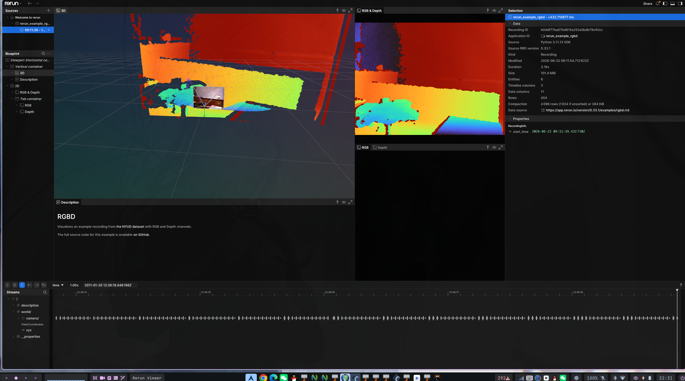
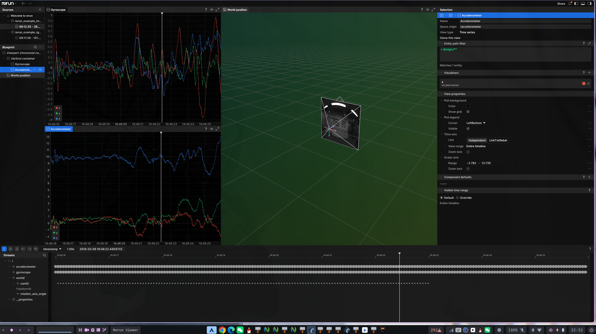
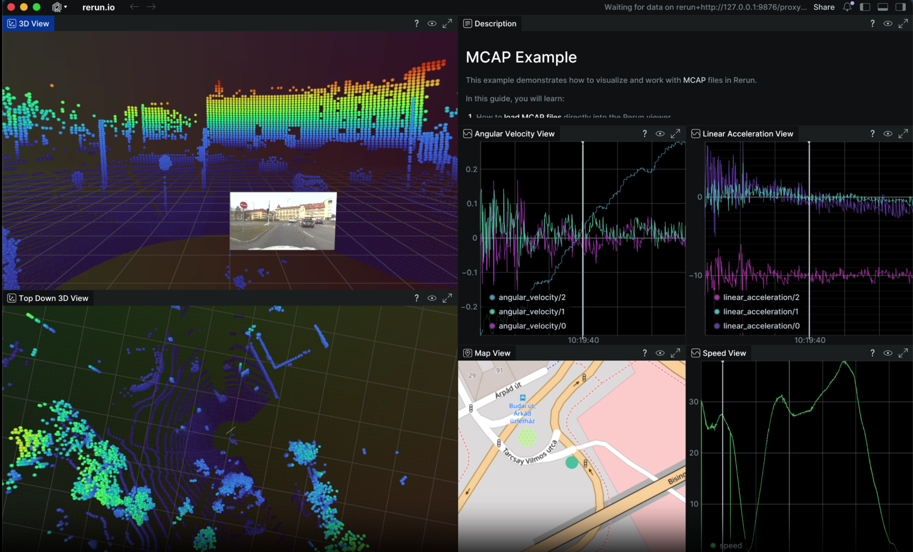

# radar-egui

基于 Rust + egui 的 RoboMaster 比赛实时雷达 HUD，承担**比赛顶层进程控制**。

## 简介

radar-egui 是比赛系统的统一操作面板：

- **Radar 标签**：场地点云 3D 可视化，通过 Rerun 引擎渲染，共享内存 `/pointcloud_frame` 读取
- **SDR 标签**：TCP 接入 SDR 信号流，实时显示 RobotMaster 战场状态
- **Laser 标签**：UDP 接收激光引导观测数据，共享内存渲染视频画面
- **进程控制**：一键启动 SDR 桥接、laser_guidance 守护进程、Unity RADAR
- **开局配置**：敌方颜色选择、推流/内录开关，启动时自动同步到 daemon

## 环境要求

- Rust 工具链 (1.75+)
- Linux (X11 或 Wayland)
- 中文字体：LXGW WenKai Mono GB Screen、JetBrainsMono Nerd Font、Maple Mono
- SDR 数据源运行在 `127.0.0.1:2000`
- laser_guidance 已构建（UDP :5001 + 共享内存 `/laser_frame`）
- Rerun viewer 已安装（`cargo install rerun-cli --locked` 或 `pip install rerun-sdk`）
- 点云数据源写入 `/pointcloud_frame`（见 `docs/pointcloud-producer-spec.md`）

## 一键部署

通过雷达系统顶层 `deploy.sh`：

```bash
cd ~/radar
./deploy.sh              # 拉取 + 构建全部
./deploy.sh egui         # 仅构建 radar-egui
./deploy.sh theme        # 安装字体 + zsh 主题
./deploy.sh autostart    # 配置开机自启动
```

## Rerun 可视化引擎

[Rerun](https://docs.rs/rerun/latest/rerun/) 是一个多模态数据流可视化框架，用于流式记录和实时查看点云、图像、标量等数据。radar-egui 通过 Rerun 实现场地点云和 SDR 机器人位置的 3D 可视化。Rerun viewer 作为独立进程运行，通过 gRPC 接收数据。

**安装 Rerun viewer：**

```bash
cargo install rerun-cli --locked
# 或通过 pip
pip install rerun-sdk
```

**启用 rerun feature：**

```bash
cargo run --release --features rerun
```

**查看场地点云：**

```bash
rerun assets/map.rrd
```

## 截图

### Rerun 3D 点云







### 集成预览


## UI 布局

- **左侧模式栏**：Radar / SDR / Laser 切换、深浅色主题、数据统计
- **中央主舞台**：Radar 点云状态面板，SDR 小地图（拖拽/缩放），Laser 视频画面（16:9）
- **Laser 右侧面板**：
  - 数据源 — UDP 连接状态与重连
  - 脚本控制 — 敌方颜色下拉、推流/内录复选框、laser_guidance 启动按钮
  - 比赛进程 — SDR/Unity 独立启停、Start All / Stop All
  - 流控制 — 运行时 Stream on/off 开关
  - 分析面板 — 目标检测/模型候选

### 当前 UI 特性

- 小地图支持拖拽、滚轮缩放和 `Reset View`
- 开局预设：敌方颜色（Red/Blue/Auto）、推流、内录，daemon 启动后通过 FIFO 自动同步
- 深色模式基于 Catppuccin 风格调色

## ZMQ 双向通信架构（开发中）

串口模块和 ZMQ 互为生产者/消费者，通过 `SerialProtocolData` 的双标志数组解耦：

```text
串口解析器                     ZMQ PUB 线程
    │                              │
    ├─ write field ───────────────┤
    ├─ serial_produced[idx]=1 ────┤ 读 → JSON → zmq_send → C++/Python
                                   │
                                   │
ZMQ SUB 线程                    串口 TX 线程
    │                              │
    ├─ zmq_recv ← C++/Python      │
    ├─ JSON 解析 → write field     │
    ├─ zmq_produced[idx]=1 ───────┤ 读 → serial_package → 串口发送
```

`serial_produced[15]` 和 `zmq_produced[15]` 各 15 个索引位，按 cmd_id 对应 `IDX_GAME_STATE`(0) 到 `IDX_SDR_JAMMING_KEY`(14)。
SDR TCP 通路后续将逐步被 ZMQ SUB 取代。

## 数据源

radar-egui 从 `alliance_radar_sdr` 通过 TCP 接收数据：

| 端口 | 方向 | 数据 |
|------|------|------|
| `127.0.0.1:2000` | 接收 | RoboMaster_Signal_Info (102 字节) |

### 数据包结构

| cmd_id | 名称 | 字段 | 字节数 |
|--------|------|------|--------|
| 0x0A01 | 位置 | 6 机器人 × [i16, i16] | 26 |
| 0x0A02 | 血量 | 6 机器人 × u16 | 14 |
| 0x0A03 | 弹药 | 5 机器人 × u16 | 12 |
| 0x0A04 | 经济 | 剩余(u16) + 总计(u16) + 状态(6B) | 12 |
| 0x0A05 | 增益 | 5 机器人 × [1+2+1+1+2] + 姿态(1) | 38 |

字节序：大部分字段大端序，增益子字段中 2 字节部分为小端序。

### 激光数据

| 端口 | 方向 | 数据 |
|------|------|------|
| UDP `0.0.0.0:5001` | 接收 | LaserObservation 协议包 |
| SHM `/laser_frame` | 读取 | RGB 视频帧（双缓冲） |

## 许可证

MIT

## 模块结构

```
src/
├── main.rs
├── app.rs / app/                    # 顶层状态、UI 视图、主题、视频纹理
├── runtime/                         # 后台线程 / Tokio runtime 生命周期
├── services/                        # 进程控制、FIFO 命令编排
├── state.rs                         # 全局共享状态
├── theme.rs                         # Catppuccin 配色
├── rerun_viz.rs                     # Rerun 3D 可视化（可选）
├── widgets/                         # egui 组件：小地图、面板、Laser 视图
│
├── serial/                          # 串口协议层
│   ├── data_format.rs               # 15 个协议结构体 + deku 位域注解 + serial_produced/zmq_produced[15]
│   ├── serial_parser.rs             # 滑动窗口 cmd_id 扫描 + 7 个 match 分支 + 脏标记置位
│   ├── serial_package.rs            # 组帧发送 (SerialFrame + RobotInteractionData)
│   ├── serial.rs                    # 串口封装 (try_clone 并发收发) + transmitter 消费 zmq_produced
│   ├── robot_interaction_id.rs      # DeviceId 枚举 (22 变体)
│   ├── serial_crc.rs                # CRC8/CRC16 校验
│   └── serialconfig.rs              # 串口配置
│
├── zmq/                             # ZMQ 进程间通信层 (Rust ↔ C++/Python)
│   ├── mod.rs                       # 模块声明
│   ├── zmq.rs                       # PUB/SUB 初始化 + send/recv 封装
│   ├── data_format.rs               # [TODO] JSON 消息格式定义 (cmd + payload)
│   ├── zmq_package.rs               # [TODO] JSON 组包 (struct → JSON string)
│   └── zmq_parser.rs                # [TODO] JSON 解包 (JSON string → struct)
│
├── sdr/                             # SDR 无线链路协议 (TCP)
│   ├── mod.rs
│   ├── protocol.rs                  # RoboMasterSignalInfo + 二进制解析器
│   └── client.rs                    # TCP 客户端 (127.0.0.1:2000)
│
├── laser/                           # Laser 协议与视频
│   ├── mod.rs                       # 模块声明
│   ├── protocol.rs                  # LaserObservation UDP 解析
│   ├── observer.rs                  # UDP 监听 (0.0.0.0:5001)
│   └── video.rs                     # 共享内存视频帧读取 (/laser_frame)
```

## 数据包结构

### 常规链路 (串口, parser 已接入)

| cmd_id | 名称 | 字段 | 字节数 |
|--------|------|------|--------|
| 0x0001 | 比赛状态 | game_type(4b) + game_progress(4b) + remain_time(u16) + unix(u64) | 11 |
| 0x0002 | 比赛结果 | winner(u8) | 1 |
| 0x0101 | 场地事件 | 14 个位域字段 (补给站/能量机关/高地/增益点/飞镖击中) | 4 |
| 0x0105 | 飞镖发射 | remain_time(u8) + hit_target(3b) + hit_count(3b) + selected(3b) | 3 |
| 0x020C | 雷达标记进度 | 12 个机器人易伤/标记位 (1b each) | 2 |
| 0x020E | 雷达自主决策同步 | weakness_chance(2b) + active(1b) + encrypt(2b) + modifiable(1b) | 1 |
| 0x0301 | 机器人交互 | RobotInteractionHeader(6) + user_data(变长, ≤112) | ≤118 |
| 0x0305 | 小地图雷达数据 | 12 机器人 × [x(u16), y(u16)] | 48 |

### SDR 无线链路 (ZMQ, 待接入)

| cmd_id | 名称 | 字段 | 字节数 |
|--------|------|------|--------|
| 0x0A01 | 对方位置 | 6 机器人 × [i16, i16] | 24 |
| 0x0A02 | 对方血量 | 6 机器人 × u16 | 12 |
| 0x0A03 | 对方弹药 | 5 机器人 × u16 | 10 |
| 0x0A04 | 对方宏观状态 | gold(u16×2) + 8 个位域状态 | 8 |
| 0x0A05 | 对方增益 | 5 机器人 × 7 字段 + 哨兵姿态 | 36 |
| 0x0A06 | 干扰密钥 | key([u8;6]) | 6 |

### 机器人交互子内容 (0x0301.data_cmd_id)

| 子内容 ID | 名称 | 字节数 |
|-----------|------|--------|
| 0x0121 | 雷达自主决策指令 (→0x8080) | 8 |

## 依赖

- `eframe` / `egui` — 即时模式 GUI
- `tokio` — 异步运行时
- `deku` — 二进制协议序列化 (位域 + 整字节混用)
- `zmq2` — ZeroMQ PUB/SUB 进程间通信 (Rust ↔ C++/Python)
- `serde` / `serde_json` — JSON 序列化 (用于 ZMQ 消息格式)
- `serial2` — 跨平台串口通信
- `libc` — 共享内存、FIFO
- `image` — 纹理加载
- `log` / `env_logger` — 日志
- `rerun` — 3D 可视化（可选 feature `rerun`）
- `gstreamer` — 视频流解码（可选 feature `video`）

MIT
