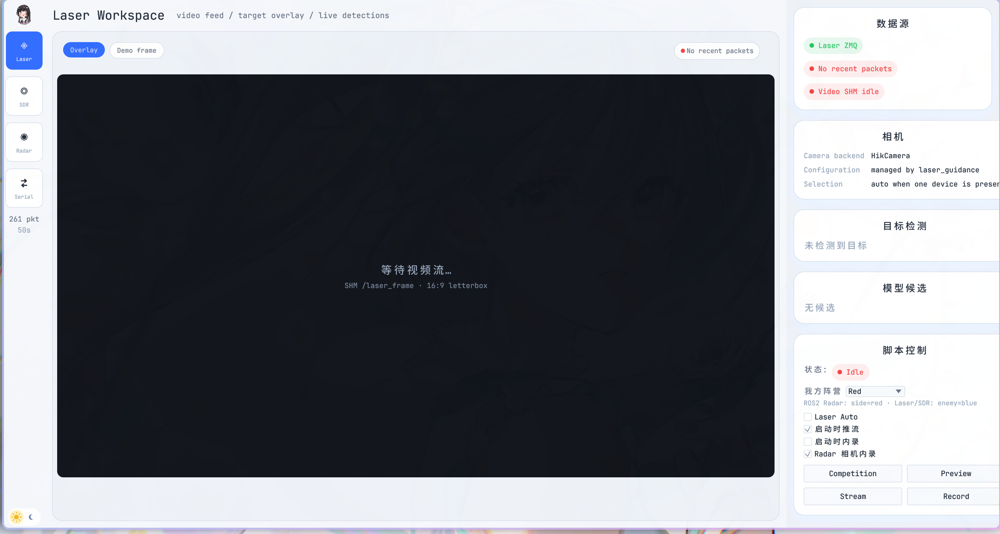
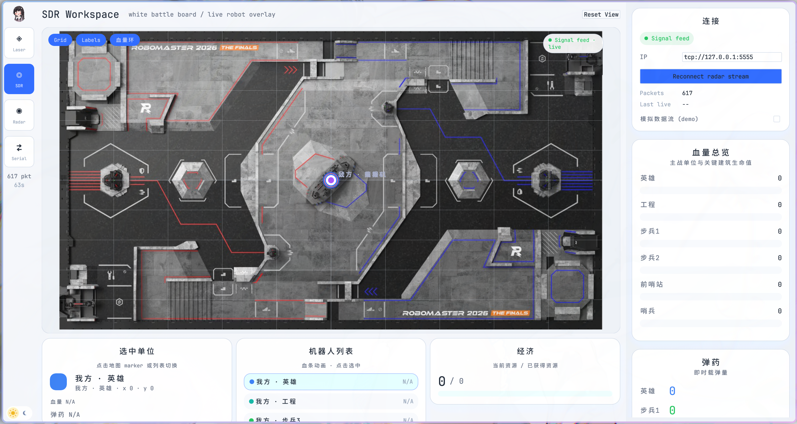
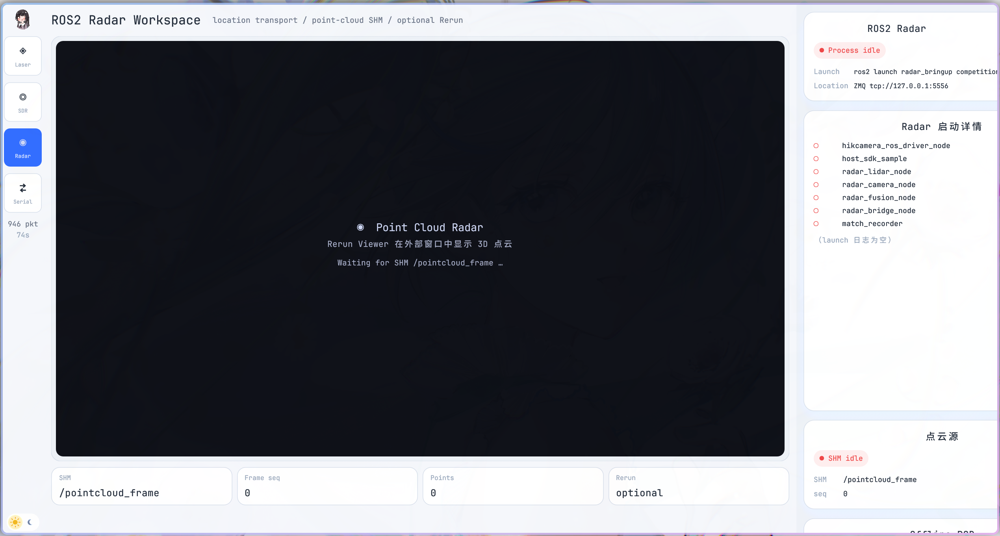
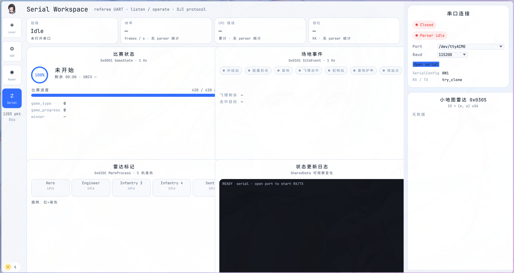
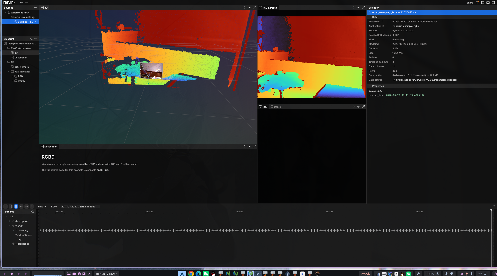
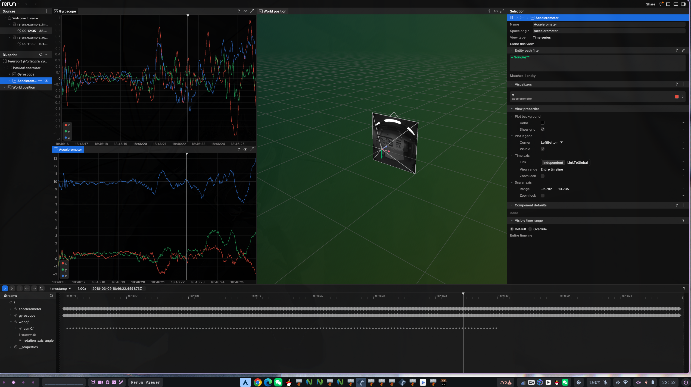
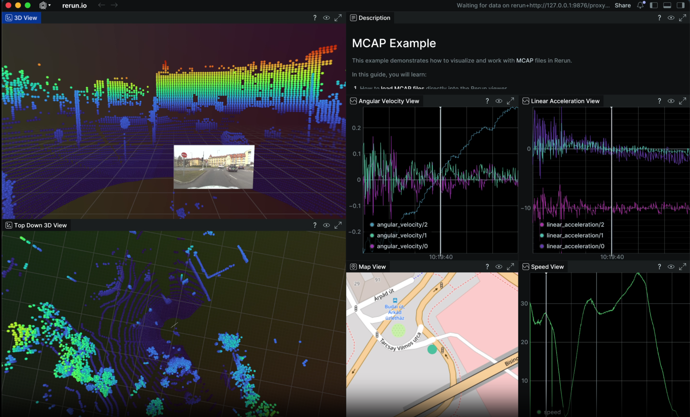

# radar-egui

基于 Rust + egui 的 RoboMaster 比赛实时雷达 HUD，承担**比赛顶层进程控制**。

## 架构设计

### Tokio 在本项目中的角色

本项目**不使用** `#[tokio::main]`，egui 主线程没有 Tokio 运行时。运行时分层：

- **主线程**：`eframe` 事件循环，每帧读取 `Arc<Mutex<T>>` 共享状态渲染 UI
- **进程控制线程**：一个 OS 线程 + 一个 Tokio runtime，运行 `ProcessRuntime` actor 并独占 `ScriptRunner`
- **ZMQ 线程**：`std::thread` 阻塞循环，直接调用 `zmq2` 同步 API
- **SHM 线程**：`std::thread` + 独立 Tokio 运行时，通过 `select!` 实现定时轮询与优雅关闭

进程控制不在 egui 帧循环中执行脚本或等待：

```text
egui → mpsc<ProcessCommand> → Tokio ProcessRuntime actor → ScriptRunner
                                      │
                                      └→ watch<ProcessSnapshot> → egui
```

命令通道是 `tokio::sync::mpsc::unbounded_channel`；`watch` 只保留最新进程阶段、组件状态、daemon 可用性和错误。`Start All` 是 actor 内的协程状态机，顺序为 **Radar → SDR → Laser Competition → FIFO 配置**，Radar 和 SDR 启动后各等待 1 秒。actor 使用 `tokio::select!` 同时等待命令、deadline 和 daemon 探测，因此 `Stop All`/`Shutdown` 在延迟和 FIFO 重试期间仍可取消剩余步骤，不再依赖 egui 每帧轮询待启动状态。

**1. 独立运行时 + `block_on` 驱动**

```rust
fn spawn_runtime_task<M, F>(make_future: M)
where M: FnOnce() -> F + Send + 'static, F: Future<Output = ()> + 'static
{
    thread::spawn(move || {
        let rt = tokio::runtime::Runtime::new();
        rt.block_on(make_future());  // 阻塞当前线程驱动 future
    });
}
```

每个 SHM 子系统拥有独立的 OS 线程 + 独立的 Tokio 运行时，互不干扰。

**2. `select!` 协作式取消**

SHM 任务通过 `watch` 关闭；进程 actor 通过命令通道关闭。两者都用 `tokio::select!` 在计时器和取消输入之间保持响应：

```rust
loop {
    tokio::select! {
        _ = interval.tick() => { /* 轮询 SHM 帧 */ }
        _ = shutdown.changed() => return,  // 优雅退出
    }
}
```

`select!` 同时等待定时器和关闭信号，第一个 Ready 的分支执行。未被选中的 Future 被 drop，实现协作式取消——task 只在 `.await` 点响应关闭，保证资源安全清理。

**3. Channel 分工**

`tokio::sync::mpsc` 传递必须逐条处理的 `ProcessCommand`；`tokio::sync::watch` 用于 `ProcessSnapshot` 和 SHM 关闭状态，只保留最新值。egui 的进程按钮只负责入队，状态展示只读取 snapshot。

**4. 懒启动 Runtime**

Video / PointCloud 的 Tokio runtime 在用户切换到对应标签时才创建（`ensure_started`），未使用的子系统零开销。

### 为什么不全用 Tokio

| 子系统 | 选择 | 原因 |
|--------|------|------|
| ZMQ SUB/PUB | `std::thread` | `zmq2` 是同步阻塞库，`recv`/`send` 天然阻塞，用 Tokio 反而需要 `spawn_blocking` 桥接 |
| Serial RX/TX | `std::thread` | 同理，`serial2` 是同步 API |
| 外部进程编排 | Tokio actor | `mpsc` 串行化命令，`select!` 让延迟、FIFO 重试和取消并存，避免阻塞 egui |
| Video / PointCloud SHM | Tokio | 需要定时轮询 + 优雅关闭 + 退避重连，`select!` + `watch` 提供最干净的实现 |

### 共享状态：`Arc<Mutex<T>>`

UI 每帧需要最新数据快照。`std::sync::Mutex` 在写少读多场景下竞争极低，比 channel 更简单——不需要"消费即删除"的语义，只需要"每次读都是最新值"。

## 简介

radar-egui 是比赛系统的统一操作面板：

- **Radar 标签**：ROS2 Radar 进程状态、LidarLocation ZMQ 传输和 `/pointcloud_frame` 点云状态；Rerun 仅作可选 3D 可视化
- **SDR 标签**：ZMQ 接入 SDR 信号流，实时显示 RobotMaster 战场状态
- **Laser 标签**：ZMQ 接收激光引导观测数据，共享内存渲染视频画面
- **进程控制**：一键启动 SDR 桥接、laser_guidance 守护进程、ROS2 Radar（`alliance_radar_location_lidar`）
- **开局配置**：全局选择我方红/蓝，自动派生 Radar 的我方 `side`、SDR 的敌方 `--enemySide` 和 Laser 的 `enemy …` FIFO 命令

## 环境要求

- Rust 工具链 (1.75+)
- Linux (X11 或 Wayland)
- 中文字体：LXGW WenKai Mono GB Screen、JetBrainsMono Nerd Font、Maple Mono
- SDR 数据源运行在 `tcp://127.0.0.1:5555`（`alliance_radar_sdr`）
- laser_guidance 已构建（ZMQ :5556 + 共享内存 `/laser_frame`）
- `alliance_radar_location_lidar` 已构建（ROS2 Jazzy workspace `ros_ws`，发布 LidarLocation 至 `tcp://127.0.0.1:5556`，见 `docs/lidar-location-protocol.md`）
- Radar 仓库默认位于 manifest 相对路径 `../../alliance_radar_location_lidar`，可用 `ALLIANCE_RADAR_LOCATION_LIDAR_ROOT` 覆盖；必须包含 `ros_ws/install/setup.bash` 和 `ros_ws/src/radar_bringup/launch/competition.launch.py`
- Laser 仓库默认位于 manifest 相对路径 `../../laser_guidance`，可用 `LASER_GUIDANCE_ROOT` 覆盖；当前脚本是 `.script/competition-laser`、`.script/preview-laser`、`.script/stream`、`.script/record`
- Radar 启动会 source ROS2 Jazzy 和 workspace 的 Bash setup，再执行 `ros2 launch radar_bringup competition.launch.py side:=<red|blue> enable_raw_recording:=<true|false>`（内录开关由 UI「Radar 相机内录」控制）
- Rerun viewer 仅在需要可选 3D 可视化时安装（`cargo install rerun-cli --locked` 或 `pip install rerun-sdk`）
- 点云数据源写入 `/pointcloud_frame`（见 `docs/pointcloud-producer-spec.md`）

## 一键部署

通过雷达系统顶层 `deploy.sh`：

```bash
cd ~/radar
./deploy.sh              # 拉取 + 构建全部
./deploy.sh egui         # 仅构建 radar-egui
./deploy.sh theme        # 安装字体 + zsh 主题
./deploy.sh autostart    # 配置开机自启动
```

## Rerun 可视化引擎

[Rerun](https://docs.rs/rerun/latest/rerun/) 是可选的多模态可视化框架。启用 `rerun` feature 后，radar-egui 可把 SDR 状态和从 `/pointcloud_frame` 读取的点云记录到外部 viewer；UI 不把 Rerun/gRPC 状态当作 ROS2 Radar 或点云数据源的连接状态。ROS2 Radar、Laser、SDR 和 Serial 的业务数据仍分别走既有 ZMQ、SHM 和 UART 链路，Rerun 不参与控制或协议桥接。

**安装 Rerun viewer：**

```bash
cargo install rerun-cli --locked
# 或通过 pip
pip install rerun-sdk
```

**启用 rerun feature：**

```bash
cargo run --release --features rerun
```

**查看场地点云：**

```bash
rerun assets/map.rrd
```

## 截图

### 面板（Laser / SDR / Radar / Serial）









### Rerun 3D 点云







### 集成预览


## UI 布局

- **左侧模式栏**：Laser / SDR / Radar / Serial 切换、深浅色主题、数据统计
- **中央主舞台**：Radar 点云状态面板，SDR 小地图（拖拽/缩放），Laser 视频画面（16:9）
- **Laser 右侧面板**：
  - 数据源 — ZMQ 连接状态（自动重连）
  - 脚本控制 — 我方阵营、自动敌方/推流/内录开关、laser_guidance 启动按钮
  - 比赛进程 — SDR / ROS2 Radar（`alliance_radar_location_lidar`）独立启停、Start All / Stop All
  - 流控制 — 运行时 Stream on/off 开关
  - 分析面板 — 目标检测/模型候选

### 当前 UI 特性

- 小地图支持拖拽、滚轮缩放和 `Reset View`
- 全局 `TeamSide` 同步到 `SharedData.radar_side`：Radar 使用我方颜色，SDR 和非 Auto Laser 使用相反颜色；Laser Auto 使用 `enemy auto`
- HikCamera 由 `laser_guidance` 配置和持有；只有一个设备时由其自动选择，radar-egui 不传相机设备参数
- 深色模式基于 Catppuccin 风格调色

## ZMQ 双向通信架构

ZMQ SUB 和串口共同更新统一的 `SharedData`。Serial parser 完成一帧后通过 `open_serial()` 配置的两个 `std::sync::mpsc::Sender<usize>`，分别通知 ZMQ PUB 和 Serial TX 查询共享状态；Serial UI 则独立读取 `SharedData` 快照，不接收 idx。这条通知 channel 与上文进程控制使用的 Tokio channel 是不同链路：

```text
串口解析器 ── write SharedData ──┬── tx.send(idx) ──▶ ZMQ PUB 查询 SharedData → JSON
                                 └── tx.send(idx) ──▶ Serial TX 查询 SharedData → UART

ZMQ SUB ── JSON 解析 ──▶ write SharedData ──▶ UI 独立读取最新快照
```

当前 ZMQ SUB 没有连接到 Serial TX 的 idx sender；Serial TX 阻塞在自己的 receiver 上，因此 ZMQ 写入本身不会触发 UART 发送。这是现有后端限制，不应描述为已接通的 ZMQ → UART 中继。

## 数据源

radar-egui 从 `alliance_radar_sdr` 通过 ZMQ 接收 `ReceiveSdr`：

| 端口 | 方向 | 数据 |
|------|------|------|
| ZMQ `tcp://127.0.0.1:5555` | 接收 | ReceiveSdr JSON（cmd_id=0x2002） |

历史 TCP `127.0.0.1:2000`、`tcp_client.rs`、`protocol.rs` 和 `RoboMasterSignalInfo` 路径已被上述 ZMQ 链路取代，不应重新作为当前架构接入。

### 激光数据

| 端口/地址 | 方向 | 数据 |
|-----------|------|------|
| ZMQ `tcp://127.0.0.1:5556` | 接收 | ReceiveLaser JSON（cmd_id=0x2003） |
| SHM `/laser_frame` | 读取 | BGR8 视频帧（双缓冲） |

### 激光雷达定位数据

| 端口/地址 | 方向 | 数据 |
|-----------|------|------|
| ZMQ `tcp://127.0.0.1:5556` | 接收 | ReceiveLidarLocation JSON（cmd_id=0x2001） |

详见 `docs/lidar-location-protocol.md`。

## 许可证

MIT

## 模块结构

```
src/
├── main.rs
├── app.rs / app/                    # 顶层状态、UI 视图、主题、视频纹理
├── runtime/                         # 后台线程 / Tokio runtime 生命周期
├── services/                        # ProcessRuntime actor、ProcessControl facade、ScriptRunner/FIFO
├── state.rs                         # 全局共享状态
├── theme.rs                         # Catppuccin 配色
├── rerun_visualizer.rs              # SDR Rerun 记录（可选）
├── widgets/                         # egui 组件：小地图、面板、Laser 视图
│
├── serial/                          # 串口协议层
│   ├── serial_parser.rs             # 滑动窗口 cmd_id 扫描 + SharedData 更新
│   ├── serial_package.rs            # 组帧发送 (SerialFrame + RobotInteractionData)
│   ├── serial.rs                    # 串口封装 (try_clone 并发收发) + RX/TX 线程
│   ├── serial_crc.rs                # CRC8/CRC16 校验
│   └── serialconfig.rs              # 串口配置
│
├── zmq/                             # ZMQ 进程间通信层 (Rust ↔ C++/Python)
│   ├── mod.rs                       # 模块声明
│   └── zmq.rs                       # PUB/SUB 线程、JSON 消息和 SharedData 桥接
│
├── sdr/                             # [REMOVED] 已删除，ZMQ 替代完成
│
├── laser/                           # Laser 协议与视频
│   ├── mod.rs                       # 模块声明
│   ├── protocol.rs                  # LaserObservation + ModelCandidate 定义
│   ├── observer.rs                  # 旧 UDP observer；当前主链路为 ZMQ SUB
│   └── video.rs                     # 共享内存视频帧读取 (/laser_frame)
│
├── pointcloud/                      # 点云处理
│   ├── mod.rs
│   ├── protocol.rs                  # PointCloudFrame 定义 + SHM 解析
│   ├── reader.rs                    # SHM /pointcloud_frame 读取
│   └── rerun_visualizer.rs          # Rerun 3D 点云日志
```

## 数据包结构

### 常规链路 (串口, parser 已接入)

| cmd_id | 名称 | 字段 | 字节数 |
|--------|------|------|--------|
| 0x0001 | 比赛状态 | game_type(4b) + game_progress(4b) + remain_time(u16) + unix(u64) | 11 |
| 0x0002 | 比赛结果 | winner(u8) | 1 |
| 0x0101 | 场地事件 | 14 个位域字段 (补给站/能量机关/高地/增益点/飞镖击中) | 4 |
| 0x0105 | 飞镖发射 | remain_time(u8) + hit_target(3b) + hit_count(3b) + selected(3b) | 3 |
| 0x020C | 雷达标记进度 | 12 个机器人易伤/标记位 (1b each) | 2 |
| 0x020E | 雷达自主决策同步 | weakness_chance(2b) + active(1b) + encrypt(2b) + modifiable(1b) | 1 |
| 0x0301 | 机器人交互 | RobotInteractionHeader(6) + user_data(变长, ≤112) | ≤118 |
| 0x0305 | 小地图雷达数据 | 12 机器人 × [x(u16), y(u16)] | 48 |

### SDR 无线链路 (已由 ZMQ 替代)

ReceiveSdr 结构体对齐串口 data_format SDR 字段，拆为 6 个子结构体：

| 子字段 | 串口对应 | 说明 |
|--------|------|------|
| `position: ReceiveSdrPosition` | `SdrEnemyRobotPositionData` | 6 机器人 × i16 x/y |
| `blood: ReceiveSdrBlood` | `SdrEnemyRobotBloodData` | 6 机器人 × u16 |
| `ammo: ReceiveSdrAmmo` | `SdrEnemyRobotRemainingAmmoData` | 5 机器人 × u16 |
| `state: ReceiveSdrState` | `SdrEnemyRobotOverallStateData` | 经济 + 15 个状态位域 + occupation_status |
| `gain: ReceiveSdrGain` | `SdrEnemyRobotGainData` | 5 机器人 × 5 增益字段 + 哨兵姿态 |
| `key: ReceiveSdrKey` | `SdrJammingKeyData` | [u8; 6] |

### ZMQ 消息 ID 空间

| 常量 | 值 | 方向 | 消息类型 |
|------|----|------|------|
| `GAME_STATE_CMD_ID` | 0x0001 | Rust → C++/Python | TransmitGameState JSON 的 `cmd_id` |
| `RADAR_MARK_PROCESS_CMD_ID` | 0x020C | Rust → C++/Python | TransmitRadarMarkProcess JSON 的 `cmd_id` |

| `ZMQ_SUB_LIDAR_LOCATION` | 0x2001 | C++/Python → Rust | ReceiveLidarLocation |
| `ZMQ_SUB_SDR` | 0x2002 | C++/Python → Rust | ReceiveSdr |
| `ZMQ_SUB_LASER` | 0x2003 | C++/Python → Rust | ReceiveLaser |

PUB JSON 复用 DJI 协议的 `CMD_ID` 常量；不存在独立的 `0x1001`/`0x1002` ZMQ PUB ID 空间。

### 机器人交互子内容 (0x0301.data_cmd_id)

| 子内容 ID | 名称 | 字节数 |
|-----------|------|--------|
| 0x0121 | 雷达自主决策指令 (→0x8080) | 8 |

## 依赖

- `eframe` / `egui` — 即时模式 GUI
- `tokio` — 异步运行时
- `deku` — 二进制协议序列化 (位域 + 整字节混用)
- `zmq2` — ZeroMQ PUB/SUB 进程间通信 (Rust ↔ C++/Python)
- `serde` / `serde_json` — JSON 序列化 (用于 ZMQ 消息格式)
- `serial2` — 跨平台串口通信
- `libc` — 共享内存、FIFO
- `image` — 纹理加载
- `log` / `env_logger` — 日志
- `rerun` — 3D 可视化（可选 feature `rerun`）
- `gstreamer` — 视频流解码（可选 feature `video`）

MIT
